# Skill 样图与地址汇总
| 样图 1 | 样图 2 | 样图 3 | Skill / 地址 | 样图作者 |
|--------|--------|--------|--------------|----------|
|  |  |  | [daily-photo-play-ground](https://github.com/luji12/daily-photo-playground) | 螂狗日记 |
|  |  |  | [dyy_photo_deconstruct](https://github.com/121dyy/dyy_photo_deconstruct) | dyy |
|  |  |  | [travel-photo-abstraction](https://github.com/Evianis/travel-photo-abstraction)| 土建三局包工头 |
|  |  |  | [gathered-scenes-zine-skill](https://github.com/Zeejay0/gathered-scenes-zine-skill) (作者下架暂时替代[gathered-scenes-zine-skill](https://github.com/yub369302-cyber/gathered-scenes-zine-skill))| 乞力马扎罗的雪 |
|  |  |  | [gc-minimal-zine-poster](https://github.com/LiamGvchi/gc-minimal-zine-poster)| AYE |
|  |  |  | [PHOTO REVIVAL](https://github.com/dacnay816y62-hub/photo-revival) | 章台竹 |
|  |  |  | [pixel-style-poster-skill](https://github.com/v92388375-gif/pixel-style-poster-skill)| 米兰的弹舌 |
|  |  |  | [scene-distillation-zine-v1-3](https://github.com/Zeejay0/gathered-scenes-zine-skill) | 知梵夜猫 |
|  |  |  | [scenes-gathered-zine-v1-3](https://github.com/Zeejay0/gathered-scenes-zine-skill) | LightJoyJet |
|  |  |  | [photo-relic-editorial](https://github.com/wnby/photo-relic-editorial)| 丁真の赛博牧场 |
|  |  |  | [photo-distill](https://github.com/yangcodingmaster/photo-distill)| yangholdon |
|  |  |  | [poetic-line-zine-poster](https://github.com/zhu930824/poetic-line-zine-poster)| 诗意线条海报 |
|  |  |  | [photo-abstract-editorial](https://github.com/ZzzLc0405/photo-abstract-editorial)| 凌云志 |
|  |  |  | [photo-to-zine-postcard](https://github.com/Whiplashzeb/photo-to-zine-postcard)| 王二_Wanger |
|  |  |  | [8-bit Pixel Fusion](https://github.com/TwentyfiveBTea/8bit-pixel-art)| Twe_5 |
|  |  |  | [Ink Wash Poster](https://github.com/TwentyfiveBTea/ink-wash-poster)| Twe_5 |
|  |  |  | [travel-photo-soft-abstraction](https://github.com/wnby/travel-photo-soft-abstraction)| 像素拌饭 |
|  |  |  | [paper-spirit-zine](https://github.com/wnby/paper-spirit-zine)| 像素拌饭 |
|  |  |  | [ai-editorial-print-studio](https://github.com/liuzihe849-png/ai-editorial-print-studio)| 理智画 |
|  |  |  | [eastern-ink-photo-diptych](https://github.com/Hiseaa/eastern-ink-photo-diptych)| 海星Hisea |
|  |  |  | [dreamy-motion-editorial](https://github.com/lzs0594/dreamy-motion-editorial)| Aomo |
| 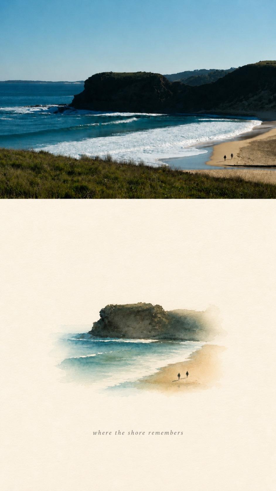 |  | 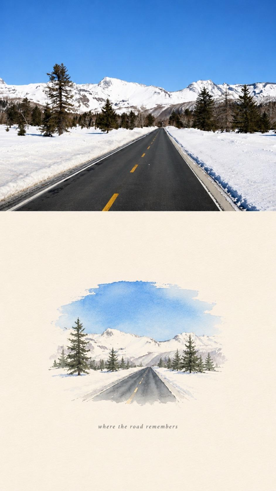 | [photo-ink-echo](https://github.com/zhouaria28-cloud/photo-ink-echo)| Cinderella |
| 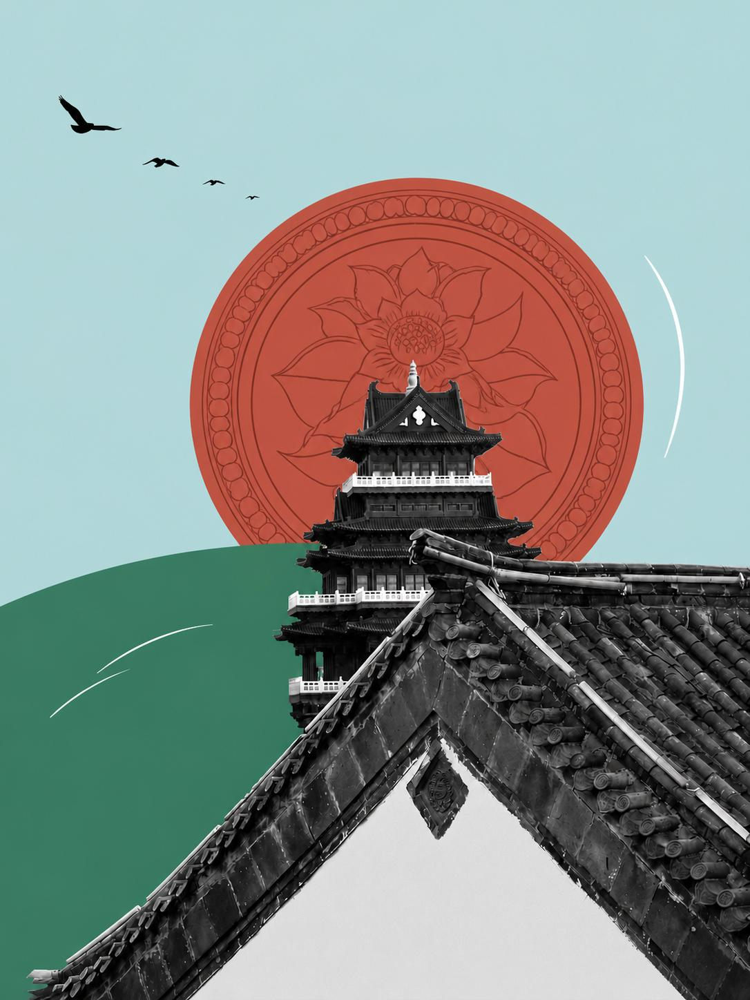 | 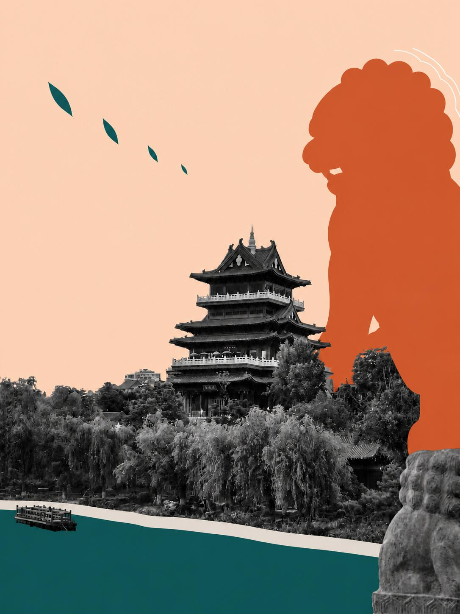 | 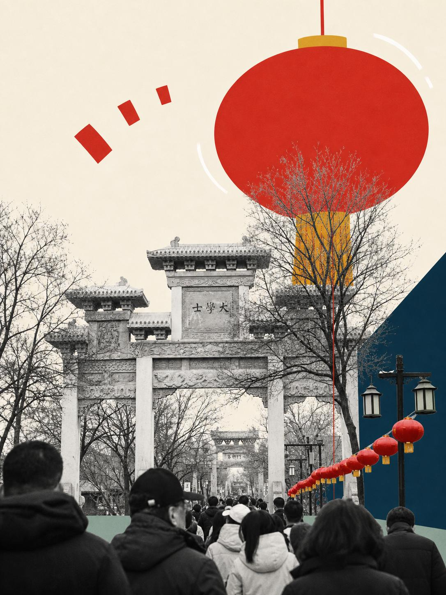 | [surreal-pop-collage](https://github.com/2998980-hue/surreal-pop-collage)| 我不爱汉堡王 |

# Prompt 样图与提示词汇总
<table width="100%">
  <tr>
    <td align="center">
      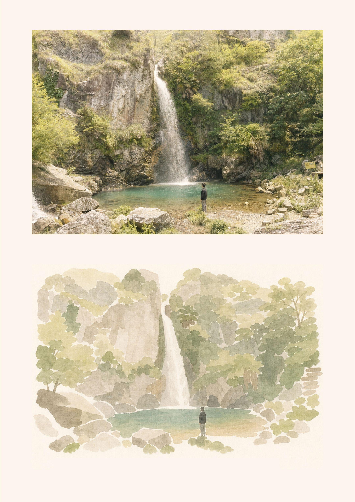
       糖油炸弹
    </td>
    <td align="center">
      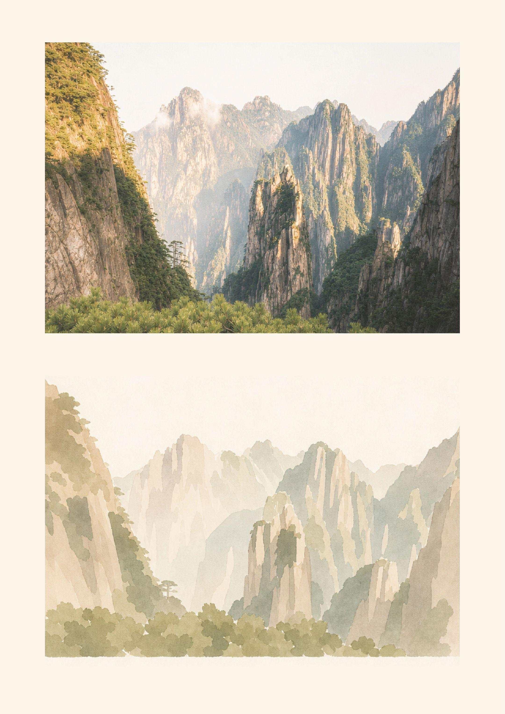
       糖油炸弹
    </td>
    <td align="center">
      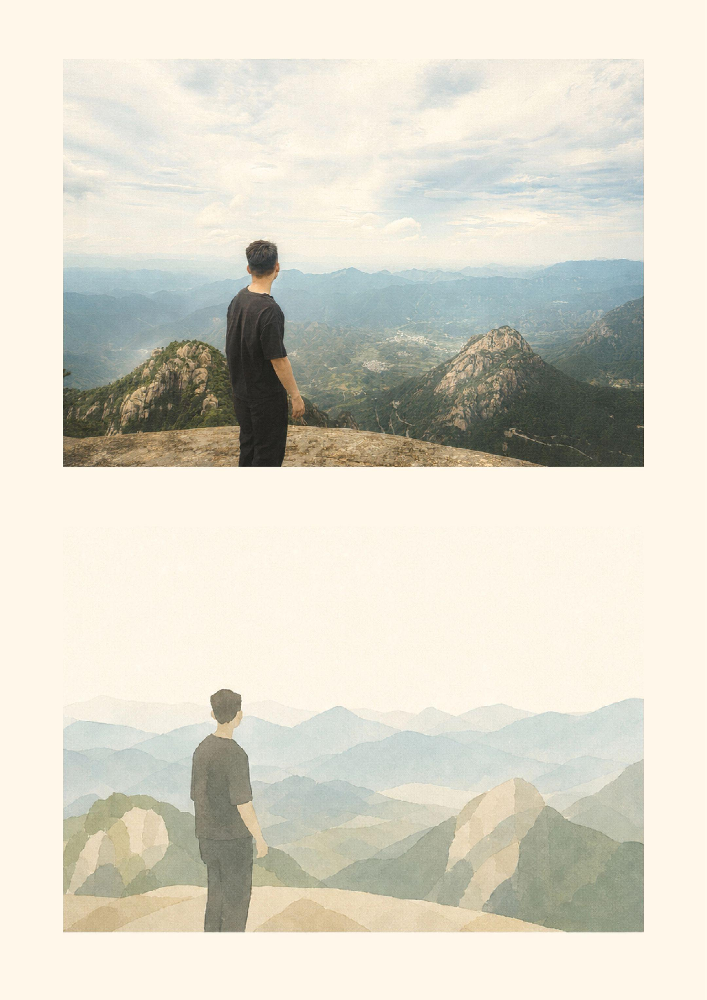
       糖油炸弹
    </td>
  </tr>
  <tr>
    <td colspan="3" align="center">
提示词:竖向二分构图哑光米白画册明信片，上下比例约 50:50。 画面上半部分：完整保留原图写实实拍风景，统一为偏亮的柯达（Kodak）高调胶片色调——整体明亮通透、带空气感的胶片质感，细腻柔光颗粒；经典柯达暖色偏移但提亮处理：阴影适度抬起、不死黑，高光呈柔润的暖白与浅金黄，边缘轻微光晕（halation）与暖化；色彩为低饱和的明亮暖调，清淡柔和、干净轻盈，不改动景物布局、轮廓与原生低饱和配色基调，仅在其上叠加柯达胶片的暖橘与米白亮层次，复刻并强化原图色彩调性。 画面下半部分：独立米色留白区域，水墨扁平解构插画——提取原图全部景物作几何极简简化，分层柔和色块，毛笔淡墨晕染笔触，无锐利硬线条，复刻原图全部色彩调性并保持与上半部一致的明亮暖调；删除全部细碎纹理、杂物、光影。 画面最底部：纤细优雅衬线英文标题。 整体：米白哑光纸张底色，大面积留白，简约东方建筑风景研究版式，干净高级，无多余装饰；全图统一偏亮、通透、轻盈的胶片气质。
整体：米白哑光纸张底色，大面积留白，大面积留白，简约东方建筑风景研究版式，干净高级，无多余装饰。
    </td>
  </tr>
 <!------------------------------------------------------------------------------------------>
 <tr>
    <td align="center">
      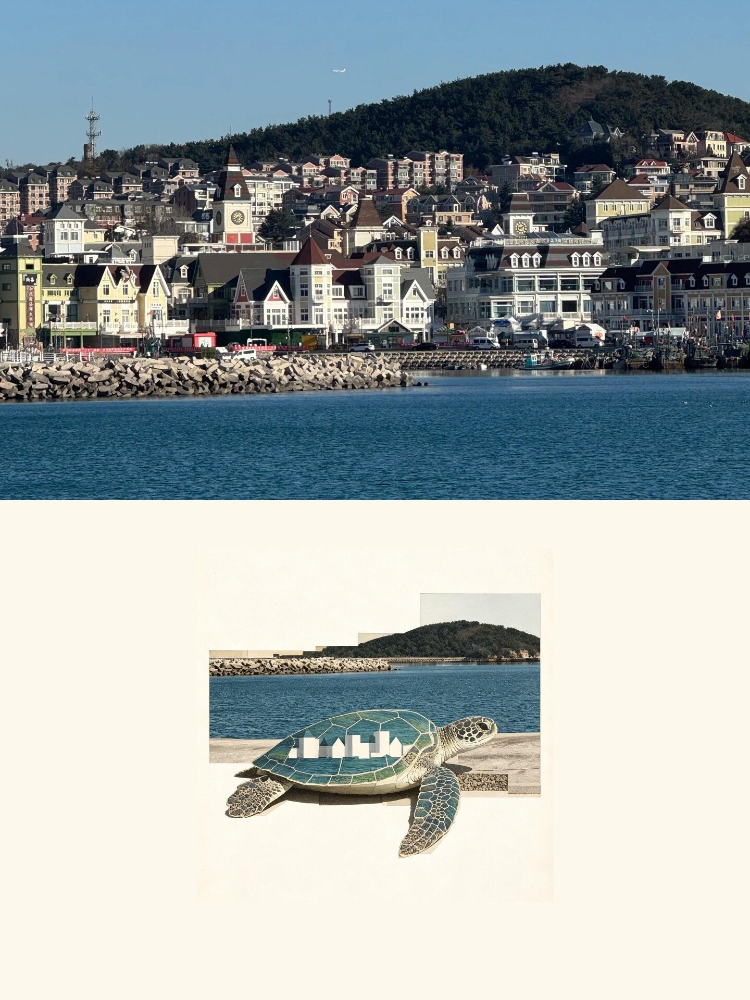
       橙不甜
    </td>
    <td align="center">
      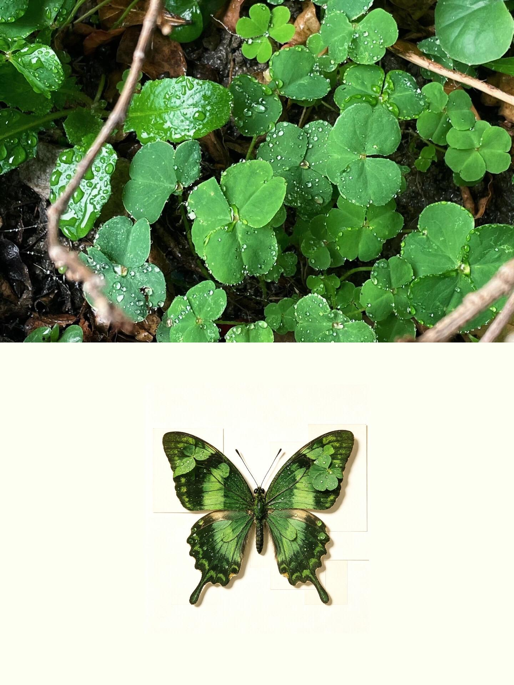
       橙不甜
    </td>
    <td align="center">
      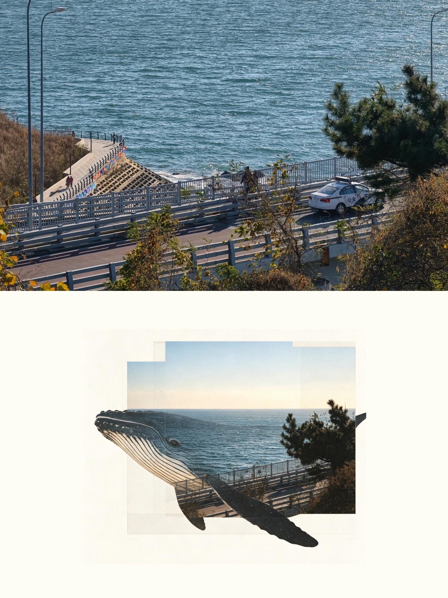
       橙不甜
    </td>
  </tr>
  <tr>
    <td colspan="3" align="center">
风格要求如下：
整体偏艺术化、克制、安静，带有现代平面设计感
主体置于大面积留白背景中，背景建议为白色、暖白色或极浅灰色
不要做成普通剪影，也不要做成写实插画
不要只是把照片硬塞进轮廓里，要保留自然纹理的流动感与图像内部的层次
可以加入适度的切片、重复、错位、阶梯边缘、分帧叠片效果，让画面更有设计语言
构图简洁，主体居中或偏中部，画面要干净
允许保留少量颗粒感、胶片感或轻微印刷质感
最终效果应像一张兼具摄影、图形设计与视觉转译意味的艺术海报
重点不是复制原图，而是提炼原图中最动人的结构与纹理，并借由新轮廓完成视觉转译。
    </td>
  </tr>
 <!------------------------------------------------------------------------------------------>
    <td align="center">
      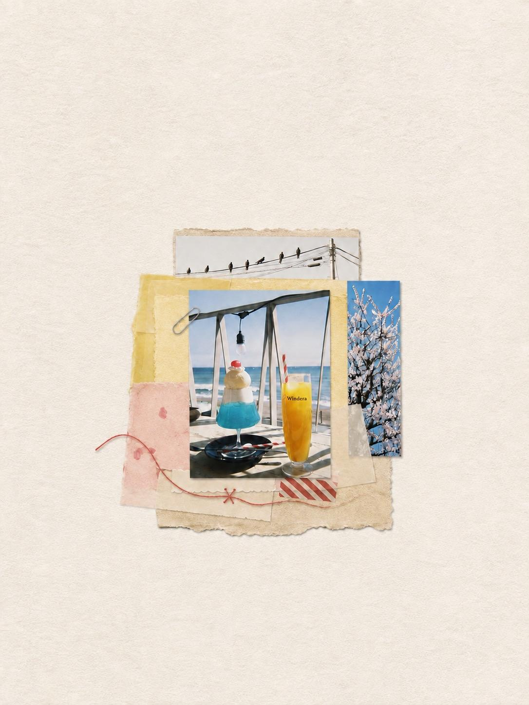
       请吃一颗绿苹果
    </td>
    <td align="center">
      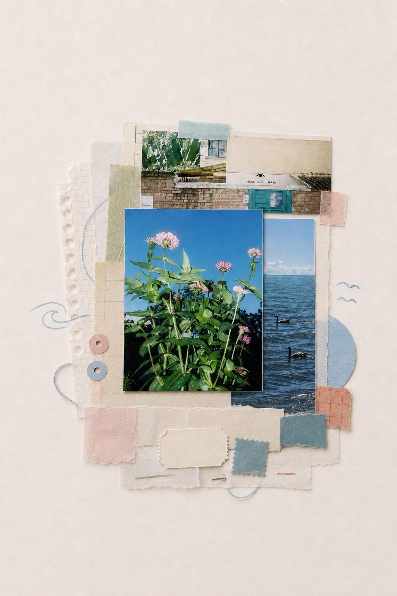
       请吃一颗绿苹果
    </td>
    <td align="center">
      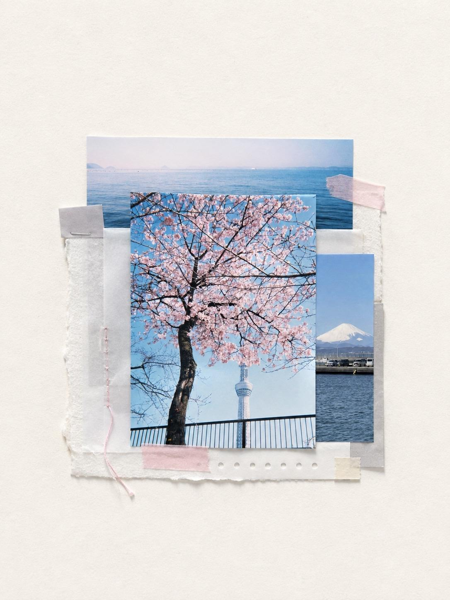
       请吃一颗绿苹果
    </td>
  </tr>
  <tr>
    <td colspan="3" align="center">
优化版的 prompt 供大家参考：请使用我上传的照片，制作一张竖版 3:4 的手工手帐拼贴。
如果用户指定了主图，严格按照指定执行；如果没有指定，请根据主体清晰度、情绪感染力、构图和辨识度，自行选择最适合作为视觉中心的一张，其余照片作为辅图。所有照片只允许裁剪，不得重绘、融合、拉伸或改变原有内容。
使用暖白色、带细微纤维质感的纸张画布。整组拼贴小巧地居中放置，可略低于视觉中心，宽度和高度均不得超过画布的一半，四周保留大面积完整留白。
主图位于最前方，裁成约 3:4 至 4:5 的短竖幅矩形，不能细长。将一张辅图裁成宽而浅的横条，藏在主图上方后侧；另一张裁成窄竖条，藏在主图右侧后方。主图必须遮住两张辅图的部分边缘，辅图不能覆盖或罩住主图。照片边缘保持干净笔直，撕边只用于后方纸张。
在照片后方加入约 10–14 层薄而真实的手帐素材，例如纤维纸、描图纸、半透明纸、手工纸、打孔边、细线、纸夹、缝线、票据碎片或少量铅笔线条。素材需根据当前照片重新选择，不要机械重复同一套装饰。
纸张应以不同大小和偏移量错落叠放，保留缝隙和不规则外轮廓，绝不能连接成正方形、长方形底板或封闭边框。丰富度只能增加在现有小型版心内部，不能扩大整组拼贴。
素材颜色以暖白、灰米、燕麦和雾灰为主，再从照片的次要颜色中选择少量低饱和点缀。如果某种颜色已经大量出现在照片里，不要再把它用于大面积纸张。素材需要清晰可见，但不能比主图更醒目。
胶带颜色根据每组照片单独选择，使用柔和的次要色；禁止黑色、炭灰色、近黑色胶带，也不要机械重复照片中占比最大的颜色。
整体应像真实手工粘贴的私人旅行手帐：安静、自然、有纸张厚度、轻微翘边、半透明重叠和柔和阴影。不要做成商业海报、整齐模板或方块拼图。默认不添加文字、Logo 或水印。
    </td>
  </tr>
 <!------------------------------------------------------------------------------------------>
  
</table>

